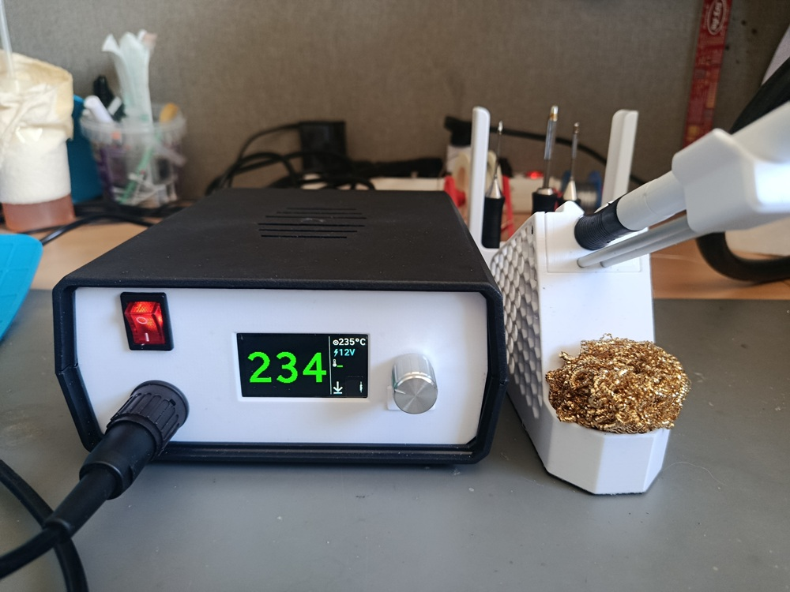

# SS3 — Solder Station 3

A DIY Weller-compatible soldering station controller, inspired by the [kair.us Weller WMRP and WMRT compatible soldering station](http://kair.us/projects/weller/index.html).

## Overview

SS3 is a two-board redesign of the kair.us open-source solder station. The key differences from the original are:

- **Transformer-based power supply** instead of SMPS — cleaner, simpler, lower EMI
- **Native 12V and 24V tip support** — handle type is identified by reading a resistor inside the handle via a voltage divider (510Ω for WXUP, 1kΩ for WMRP, 2kΩ for WMRT)
- **MSPM0G1507SRHBR MCU** (Texas Instruments) replacing the PIC16F1788
- **Dual MOSFET back-to-back switching stage** acting as a solid-state triac with minimal conduction losses

## Hardware — Two Boards

### MCU / Display Board
Handles all control logic, ADC measurements, and user interface.

- MSPM0G1507SRHBR microcontroller (default)
  - MSPM0G1505SRHBR can be used for 7-segment display builds
  - MSPM0G1506SRHBR can be used for TFT display builds
  - Switching variant requires updating `device_linker.cmd`
- Onboard ADC for thermocouple sensing (cold-junction compensation is handled inside the handle itself)
- Display support:
  - 4× 7-segment LED display
  - 1.9" TFT color screen

### Power Board
Drives the resistive heating element of the tip.

- Four dual N-MOSFET ICs (8 MOSFETs total), one per heating channel: two channels (left/right) × two voltages (12V/24V), each pair wired back-to-back
- Each pair acts as a solid-state triac equivalent, covering both 12V and 24V channels
- Lower switching losses compared to a traditional triac

## Tip Compatibility

Compatible with Weller active tips using an integrated heater and thermocouple:

- **WMRP** — soldering pen (12V)
- **WMRT** — desoldering tweezers (12V)
- **WXUP** — soldering pen (24V)

## Directory Structure

```
SS3/
├── 3D/       — Stands and handle models (12V and 24V variants; no enclosure provided)
├── PCBS/     — KiCad / Gerber files for both boards, plus KiCad conversions of the
│              original kair.us WMRP and WMRT boards (including mirrored variant for
│              mirrored jack barrels)
├── SIMS/     — LTSpice simulations: zero-cross detection, 3.6V SMPS from half-wave
│              rectifier, and back-to-back N-MOSFET triac equivalent
└── SS3/      — Firmware source (CMake project)
```

## Credits

Based on the open-source [Weller WMRP and WMRT compatible soldering station](http://kair.us/projects/weller/index.html) by kair.us.
